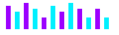

<!-- Matrix Cyber Banner -->

 

<!-- Top Hero Section: Side-by-Side Terminal Windows -->
<table>
  <tr>
    <td valign="top">
      
    </td>
    <td valign="top">
      
    </td>
  </tr>
</table>

## Cyril P Jose

  📍 Kerala, India &nbsp;·&nbsp; 🎓 SJCET Palai &nbsp;·&nbsp; 💡 Empowering Through Code &amp; Teaching

<!-- Social & Contact Badges -->

 

<!-- Animated Lo-Fi Equalizer -->

  

 

### 💻 Interactive Terminal

  
<code>guest@cyril-sys:~$ ./skills.sh</code>

   
  <blockquote>
    
Loading skills module...

    <ul>
      <li><b>Languages:</b> Python, JavaScript, C, SQL, Java</li>
      <li><b>Frameworks:</b> React, Node.js, Next.js, Flask</li>
      <li><b>Tools:</b> Git, n8n, Vercel, OpenCV</li>
    </ul>
  </blockquote>

  
<code>guest@cyril-sys:~$ ./about.sh</code>

   
  <blockquote>
    
Hi, I'm Cyril! I'm a CSE student who loves building AI tools, automation scripts, and full-stack web applications. My goal is to empower others through code and teaching.

  </blockquote>

 

### 🛠️ Tech Stack

  

 

### 🔭 Currently Exploring

  

---

### 🚀 Featured Projects

<table>
  <tr>
    <td width="50%" valign="top">
      <h4>⛅ <a href="https://github.com/cyril-p-jose/SkyFlow-weather-app">SkyFlow Weather App</a></h4>
      
Modern weather forecasting web application offering real-time atmospheric tracking, city search, and responsive climate data visualization.

      
<code>CSS</code> <code>JavaScript</code> <code>Weather API</code>

    </td>
    <td width="50%" valign="top">
      <h4>🚗 <a href="https://github.com/cyril-p-jose/Driver-Monitoring-System">Driver Monitoring System</a></h4>
      
Computer vision-driven safety solution engineered to detect driver alertness and prevent fatigue-related road hazards in real time.

      
<code>Python</code> <code>OpenCV</code> <code>Computer Vision</code>

    </td>
  </tr>
  <tr>
    <td width="50%" valign="top">
      <h4>💻 <a href="https://codehack-webapp.vercel.app/">CodeHack</a></h4>
      
Collaborative developer platform and resource hub designed to streamline coding workflows, challenge solving, and hackathons.

      
<code>React</code> <code>Node.js</code> <code>Vercel</code>

    </td>
    <td width="50%" valign="top">
      <h4>🤖 <a href="https://github.com/cyril-p-jose/n8n-ai-news-telegram-bot">n8n AI News Telegram Bot</a></h4>
      
Automated intelligence workflow integrating Google Gemini, n8n, and NewsAPI to summarize breaking news topics directly to Telegram.

      
<code>n8n</code> <code>Google Gemini</code> <code>Multi-Agent AI</code>

    </td>
  </tr>
</table>

---

### 📊 GitHub Activity &amp; Contributions

  
  

 

<!-- Animated Snake Contribution Graph -->

 

