<!-- Top Hero Section: Side-by-Side Terminal Windows -->
<table>
  <tr>
    <td valign="top">
      
    </td>
    <td valign="top">
      
    </td>
  </tr>
</table>

## Cyril P Jose
**B.Tech CSE Student | Aspiring Teacher & Software Developer**

  📍 Kerala, India &nbsp;·&nbsp; 🎓 SJCET Palai &nbsp;·&nbsp; 💡 Empowering Through Code &amp; Teaching

<!-- Social & Contact Badges -->

 

---

### 🚀 Featured Projects

<table>
  <tr>
    <td width="50%" valign="top">
      <h4>⛅ <a href="https://github.com/cyril-p-jose/SkyFlow-weather-app">SkyFlow Weather App</a></h4>
      
Modern weather forecasting web application offering real-time atmospheric tracking, city search, and responsive climate data visualization.

      
<code>CSS</code> <code>JavaScript</code> <code>Weather API</code>

    </td>
    <td width="50%" valign="top">
      <h4>🚗 <a href="https://github.com/cyril-p-jose/Driver-Monitoring-System">Driver Monitoring System</a></h4>
      
Computer vision-driven safety solution engineered to detect driver alertness and prevent fatigue-related road hazards in real time.

      
<code>Python</code> <code>OpenCV</code> <code>Computer Vision</code>

    </td>
  </tr>
  <tr>
    <td width="50%" valign="top">
      <h4>💻 <a href="https://codehack-webapp.vercel.app/">CodeHack</a></h4>
      
Collaborative developer platform and resource hub designed to streamline coding workflows, challenge solving, and hackathons.

      
<code>React</code> <code>Node.js</code> <code>Vercel</code>

    </td>
    <td width="50%" valign="top">
      <h4>🤖 <a href="https://github.com/cyril-p-jose/n8n-ai-news-telegram-bot">n8n AI News Telegram Bot</a></h4>
      
Automated intelligence workflow integrating Google Gemini, n8n, and NewsAPI to summarize breaking news topics directly to Telegram.

      
<code>n8n</code> <code>Google Gemini</code> <code>Multi-Agent AI</code>

    </td>
  </tr>
</table>

---

### 📊 GitHub Activity &amp; Contributions

<!-- Animated Contribution Graph -->

 

