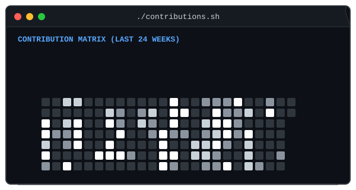

<p align="center">
  
</p>

```text
╔══════════════════════════════════════════════════════════════════════════════╗
║                                                                              ║
║  CYRIL@GITHUB                                                                ║
║  Terminal-inspired developer environment configuration file initialized.    ║
║                                                                              ║
╚══════════════════════════════════════════════════════════════════════════════╝
```

---

### $ whoami

<p align="center">
  
  
</p>

```text
> Fetching identity information...
NAME       : Cyril P Jose
GOAL       : Aspiring Teacher & Software Developer
COLLEGE    : St. Joseph's College of Engineering and Technology, Palai
EDUCATION  : B.Tech Computer Science and Engineering Student
```

---

### $ ./contributions.sh

<p align="center">
  
</p>

---

### $ cat stack.txt

```text
LANGUAGES  : Java • Python • C • JavaScript
FRONTEND   : HTML • CSS • React
BACKEND    : Node.js • Express • Flask
DATABASE   : MongoDB • MySQL
AI & ML    : Gemini • Generative AI • Computer Vision
TOOLS      : Git • GitHub • Google AI Studio
```

---

### $ ls projects/

Here are key projects loaded from the environment parameters:

* **[SkyFlow Weather App](https://github.com/cyril-p-jose/SkyFlow)**: Futuristic Weather visualization and forecasting interface.
* **Driver Monitoring System**: Computer Vision driver drowsiness and distraction detection.
* **AI Career Assistant**: Gemini-powered CV optimizer and mock interview engine.
* **Client Lead Management System**: Full-stack CRM with automated lead score predictive routing.
* **CopyNest AI**: Generative AI copywriting companion and content parser.
* **LocalBiz UGC AI**: Automated user-generated content validation engine for local businesses.
* **n8n Participant Onboarding Automation**: Workflow automation routing onboarding steps dynamically.

---

### $ git log --oneline

<p align="center">
  
</p>

---

<p align="center">
  <code style="font-family: monospace; font-size: 14px;">echo "Thanks for visiting! System connection terminated."</code>
</p>
